# Weather Monitoring Frontend

This is the frontend for the Weather Monitoring application. It is built using Next.js and interacts with the backend service to provide real-time weather data, daily summaries, historical trends, and alert configurations.

## Table of Contents
- [Prerequisites](#prerequisites)
- [Installation and Running the Application](#installation)
- [Project Description](#project-description)
- [UI Walkthrough](#ui-walkthrough)
- [Technologies Used](#technologies-used)

---

## Prerequisites

Before you begin, ensure you have met the following requirements:

- **Node.js**: You need to have Node.js installed on your machine. You can download it from [Node.js official website](https://nodejs.org/).
- **npm**: npm (Node Package Manager) is usually included with Node.js. You can verify the installation by running:
  ```bash
  npm -v
  ```

## Installation

### 1. Clone the repository
```bash
git clone https://github.com/Akanth24/weather-monitoring-frontend.git
```
```bash
cd weather-monitoring-frontend
```

### 2. Install Dependencies
```bash
npm install
```

### 3. Run the Application
```bash
npm run dev
```

## Project Description
#### Weather Monitoring System with Visualizations
The frontend of the weather monitoring system provides a user-friendly interface for displaying real-time weather data, daily summaries, and triggered alerts. The data is visualized to help users understand weather trends over time and monitor specific alert conditions. Users can also configure alert thresholds through the UI.

#### Features:

#### Real-time Weather Display:
- Users can view current weather conditions (temperature, humidity, wind speed, etc.) for metro cities in India, including other cities they enter manually.
- Temperature units are customizable between Celsius, Kelvin, and Fahrenheit based on user preference.

#### Daily Weather Summaries:
- Visualizations show daily weather summaries, including:
    - Average, minimum, and maximum temperatures.
    - Average humidity and wind speed.
    - Dominant weather condition for the day (e.g., clear, rain).

- The history page shows a graphical analysis of temperature, humidity, and wind speed for specific dates.

- Users can retrieve daily summaries for past 1, 2, 3, 5, or 7 days.

#### Threshold page
- Users can set thresholds for conditions like temperature, weather conditions and receive notifications over email when the thresholds are breached.
- The interface allows managing alerts by creating, editing, and deleting thresholds.

---

## UI Walkthrough

### 1. Home Page

| Home Page |
|-----------|
| 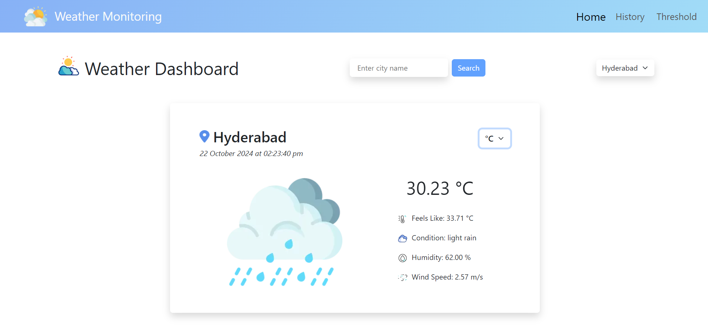 |


### 2. History Page

| Daily Weather Summary | Temperature Graph |
|-----------------------|---------------------|
| 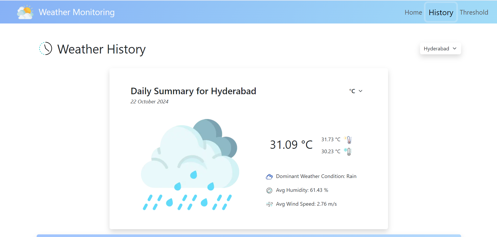 | 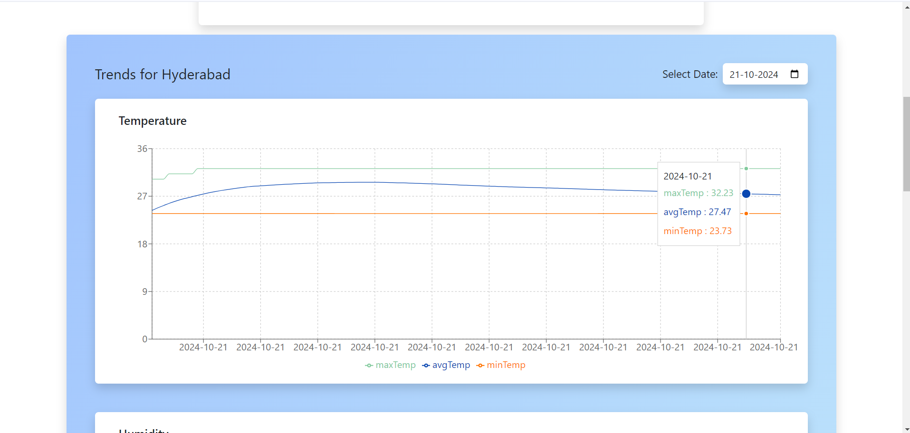 |

| Humidity Graph | Wind Speed Graph |
|----------|---------------|
| 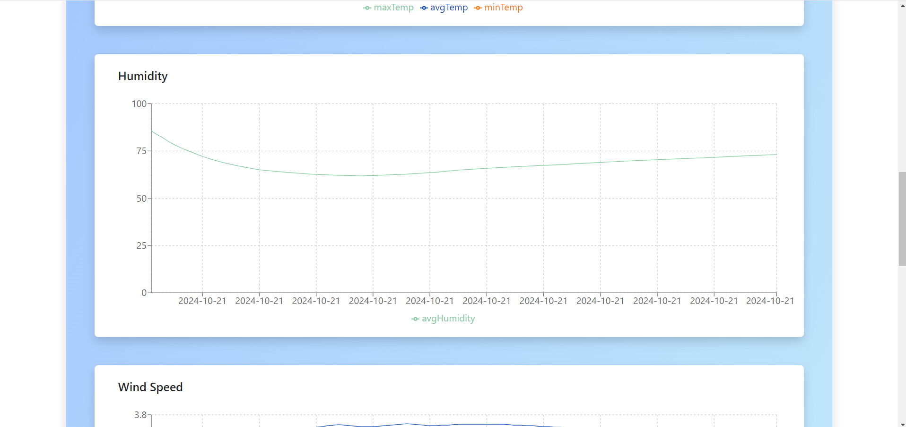 | 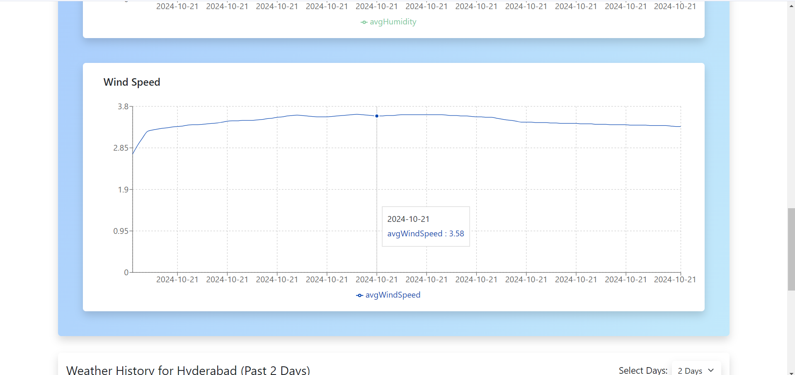 |


| Past Days History |
|-----------|
| 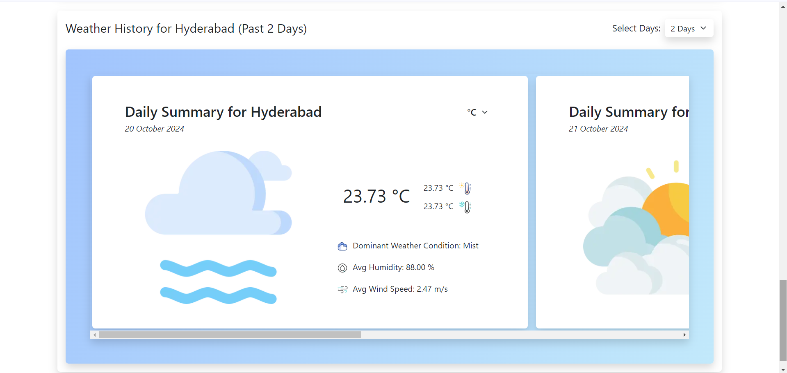 |


### 3. Threshold Page

| Thresholds |
|-----------|
| 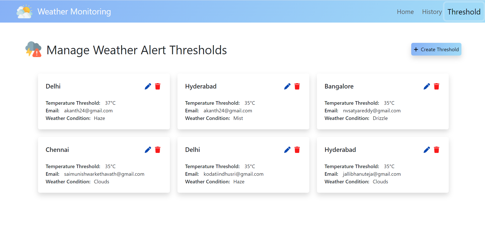 |

| Create Threshold |
|-----------|
| 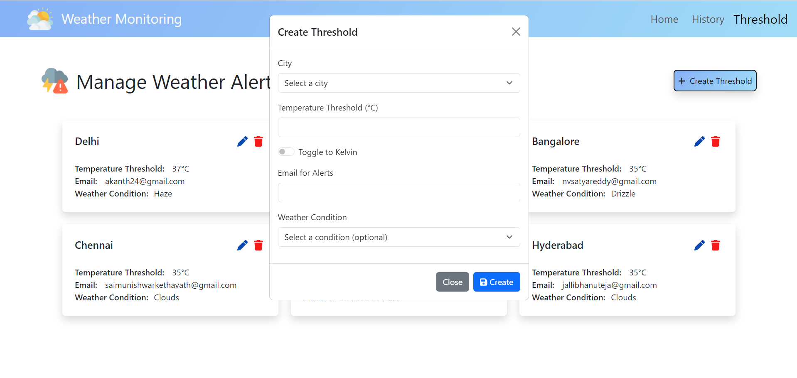 |

| Edit Threshold | Delete Threshold |
|---------------|-----------------|
| 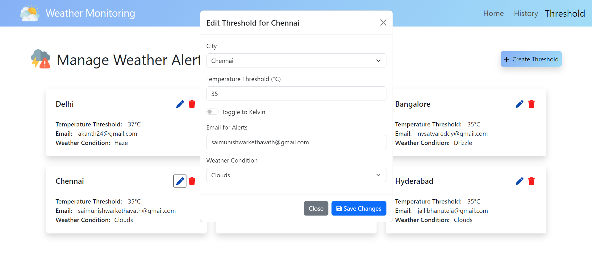 | 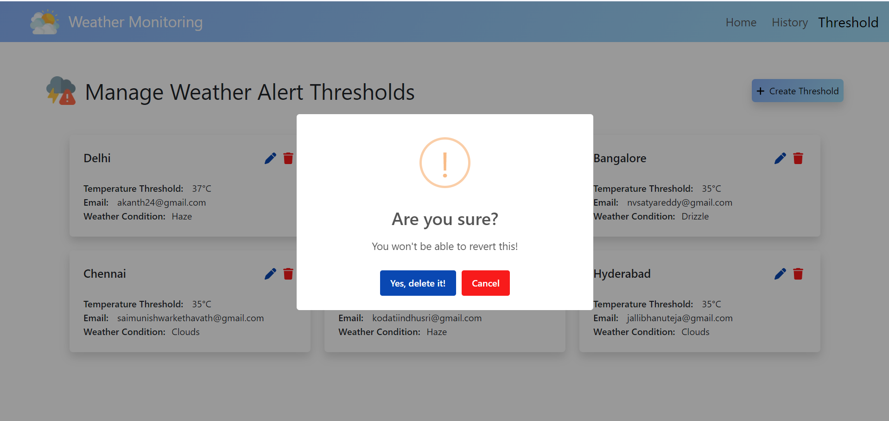 |

### 4. Email Alert

| Email Alert |
|---------------------|
| 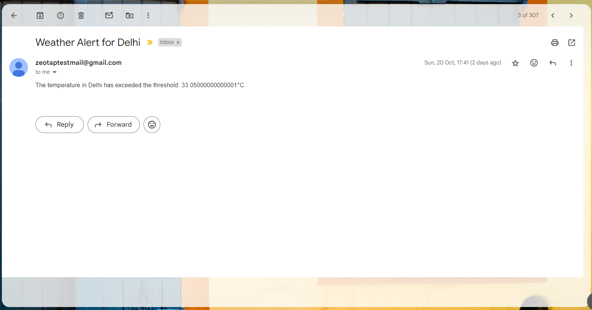 |

### 5. Loading and Not Found Page

| Loading Page | Not Found Page |
|-----------------------|---------------------|
| 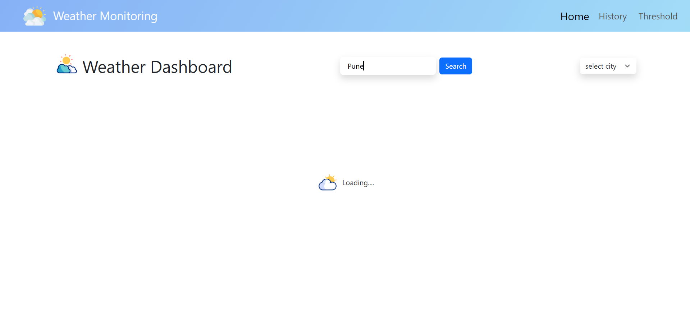 | 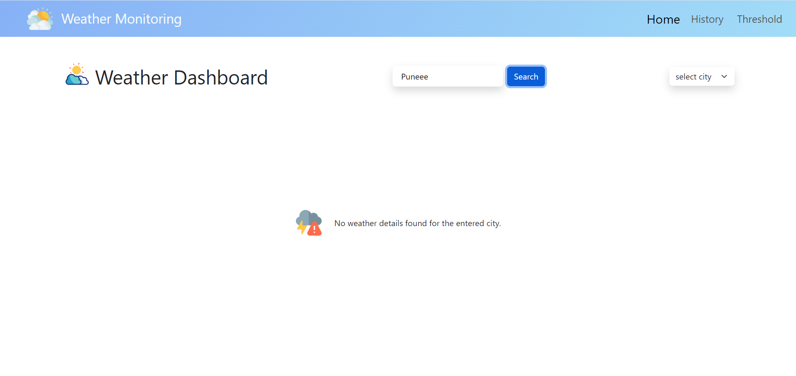 |

---

## Technologies Used

- **Next.js** - A React framework for building server-side rendered applications.
- **Axios** - Promise-based HTTP client for interacting with the backend.
- **React** - A JavaScript library for building user interfaces.
- **Bootstrap** - For UI styling and responsive design.
- **SweetAlert2** - Provides customizable and user-friendly alert notifications.
